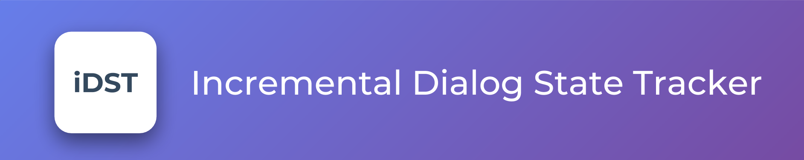

### Description

A Dialog State Tracker (DST) is an important component in modern spoken dialog systems. In this repository. This repository provides an incremental version of an DST, which differs from classic turn-by-turn approaches by providing a word-by-word implementation.

### Requirements (from `pip freeze`)

| requirement      | version    |
|:-----------------|:-----------|
| certifi          | 2018.11.29 |
| pipenv           | 2018.11.26 |
| virtualenv       | 16.1.0     |
| virtualenv-clone | 0.4.0      |

### Repository contents

* 📁 idst_util

	* `dstc_util.py`: checks if dstc2 dataset is in root folder, otherwise it downloads it. It provides also a raw features extractor
	* `trivial.py`: logs some trivial strings

* 📁 resources
	
	* 📁 images: some images for the Markdown files
	* 📁 papers: relevant papers with summary

* `[LecTrack]baseline.ipynb`: PyTorch implementation of LecTrack as baseline

* `dstc2_data_analysis.ipynb`: data analysis of DSTC2 dataset